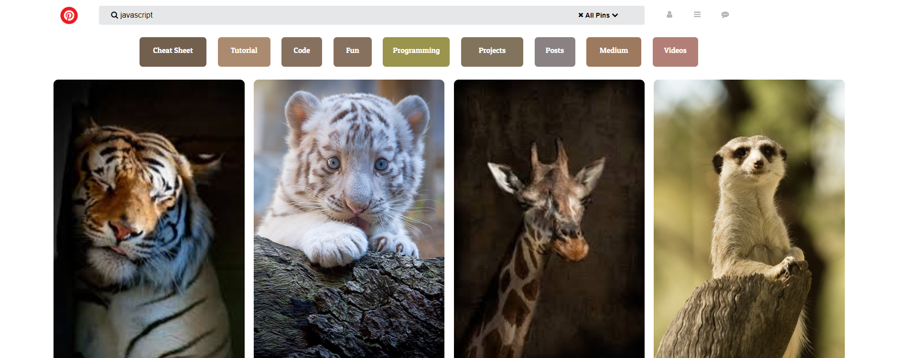

# Pinterest

Práctica.

## Se utilizó

`HTML`   `CSS`

## Descripción

En este trabajo de aplica lo aprendido sobre **Box-model**, **positioning**, **tipografias**, **iconos** entres otras propiedades,

para recrear una página de Pinterest como el ejemplo dado en LMS.

## Muestra del trabajo

`Nota:`

*Este trabajo se ha subido a gh-pages [aquí](https://yaniraab.github.io/pinterest/).
